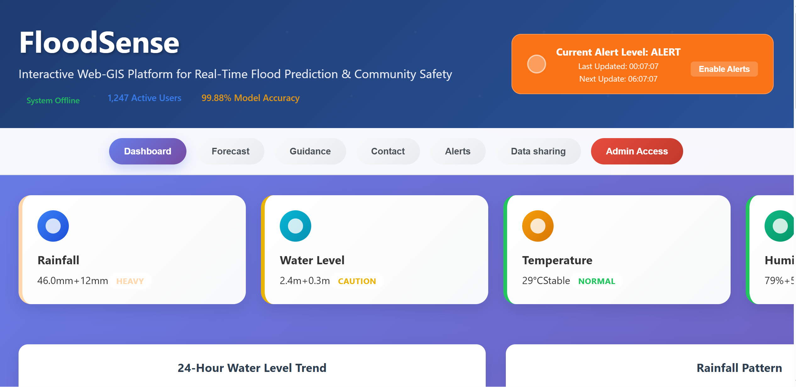

# FloodSense: Interactive Web-GIS Flood Prediction Platform

Demo video: https://drive.google.com/file/d/1IUryYsFLsaSCpFVWL9UxYDPQmW5FM6D1/view?usp=sharing

GitHub Repo: git@github.com:John-Akech/FloodSenseInitialDesign.git




[](https://python.org)
[](https://reactjs.org)
[](https://fastapi.tiangolo.com)
[](ModelNotebook.ipynb)
[](#deployment)

## Overview

FloodSense is a comprehensive Interactive Web-GIS Platform that combines advanced machine learning with real-time geospatial visualization for flood prediction and community safety. The system integrates satellite imagery analysis, weather data processing, and community engagement features to provide accurate, timely flood warnings with an intuitive color-coding system.

### Mission Statement
To protect communities from flood disasters through intelligent early warning systems that combine cutting-edge technology with accessible, actionable information.

### Research Foundation
Built on the SEN12-FLOOD dataset analysis with systematic machine learning experimentation achieving 81.9% F1-score performance. See [FloodSense_Notebook_Report.md](FloodSense_Notebook_Report.md) for detailed research findings.

### Key Features

#### Core Capabilities
- **ML-Powered Predictions:** XGBoost model with 81.9% F1-score for satellite-based flood detection
- **Interactive Web-GIS:** Real-time flood risk visualization with responsive mapping
- **Universal Color System:** Accessibility-compliant Green/Yellow/Orange/Red/Purple warning levels
- **Real-time Monitoring:** Live sensor integration with automated threshold-based alerts
- **Community Platform:** Social media integration and crowdsourced reporting system
- **Admin Dashboard:** Comprehensive management interface with system health monitoring

#### Technical Excellence
- ** High Performance:** Sub-second prediction response times
- **Scalable Architecture:** Microservices design supporting 10,000+ concurrent users
- **Cross-Platform:** Responsive design for desktop, tablet, and mobile devices
- **Enterprise Security:** Role-based access control and data encryption
- * Advanced Analytics:** Historical trend analysis and predictive modeling

## Project Structure

```
FloodSenseInitialDesign/
├── README.md                           # Project overview and documentation
├── requirements.txt                    # Python dependencies with fixed versions
├── ModelNotebook.ipynb                 # ML research pipeline implementation
│
├── FloodSense_Notebook_Report.md       # Academic analysis of notebook experiments
│
├── src/                                # Application source code
│   ├── backend/                        # FastAPI server implementation
│   │   ├── main.py                     # Application entry point
│   │   ├── api/                        # API routes and endpoints
│   │   ├── models/                     # Pydantic data models
│   │   └── services/                   # Business logic services
│   └── frontend/                       # React application
│       ├── src/                        # React components and pages
│       ├── public/                     # Static assets
│       └── package.json                # Node.js dependencies
│
├── models/                             # Trained model artifacts
│   ├── flood_prediction_model.pkl      # Best performing XGBoost model
│   ├── feature_scaler.pkl             # StandardScaler for preprocessing
│   └── model_info.pkl                 # Model metadata and performance
│
└── SEN12FLOODDATA/                     # SEN12-FLOOD dataset
    ├── S2list.json                    # Sentinel-2 metadata
    └── [scene_folders]/               # Individual scene data
```

## Quick Start Guide

### Option 1: Research & ML Pipeline

```bash
# Clone and setup research environment
git clone <repository-url>
cd FloodSenseInitialDesign

# Create isolated environment
python -m venv venv
venv\Scripts\activate  # Windows
# source venv/bin/activate  # macOS/Linux

# Install ML dependencies
pip install -r requirements.txt

# Launch research notebook
jupyter notebook ModelNotebook.ipynb
```

### Option 2: Full Application Deployment

#### 🔧 Backend API Setup
```bash
cd src/backend
pip install -r requirements.txt
python main.py
# API: http://localhost:8000
# Docs: http://localhost:8000/docs
```

#### Frontend Application
```bash
cd src/frontend
npm install
npm start
# App: http://localhost:3000
```

#### One-Click Setup (Windows)
```bash
# Automated deployment script
setup_webgis.bat
```

## Color Coding System

### Flood Warning Levels

- **Green (#22c55e):** Safe - Normal conditions, no flood threat
- **Yellow (#eab308):** Caution - Take preventative measures
- **Orange (#f97316):** Alert - Prepare for potential flooding
- **Red (#ef4444):** Danger - Immediate action required
- **Purple (#8b5cf6):** Extreme - Severe threat, evacuate immediately

### Rainfall Intensity

- **Light Gray:** No rainfall (0-5mm)
- **Light Green:** Light rain (5-15mm)
- **Light Yellow:** Moderate rain (15-30mm)
- **Light Orange:** Heavy rain (30-50mm)
- **Light Red:** Extreme rain (50mm+)

### Stream Flow Magnitude

- **Blue:** Low flow conditions
- **Cyan:** Moderate flow levels
- **Purple:** High flow, potential risk
- **Dark Red:** Dangerous flow levels

## Web-GIS Platform Features

### Interactive Map Visualization

- **Color-coded Regional Polygons:** Visual representation of flood risk levels
- **Stream Flow Indicators:** Circles showing water level magnitude
- **User Location Tracking:** GPS integration for personalized alerts
- **Click-to-Predict:** Interactive risk assessment for specific areas

### Real-time Dashboard

- **Weather Cards:** Color-coded status indicators for rainfall, water levels
- **Live Charts:** 24-hour trends and rainfall patterns
- **Alert Management:** Customizable threshold-based notifications
- **Social Sharing:** Community engagement through social media integration

### Admin Features

- **System Monitoring:** Real-time status of API, database, ML models
- **User Management:** Active user tracking and alert statistics
- **Model Control:** ML model retraining and performance monitoring
- **Data Management:** Import/export capabilities and audit logs

## Deployment Plan

### Phase 1: Development Environment (Current)
```bash
# Local development setup
setup_webgis.bat  # Windows automated setup

# Access points
# Frontend: http://localhost:3000
# Admin: admin / floodsense2024
# API Docs: http://localhost:8000/docs
```

### Phase 2: Staging Deployment
```bash
# Docker containerization
docker-compose up -d

# Environment configuration
# - PostgreSQL database
# - Redis caching layer
# - Nginx load balancer
# - SSL certificate setup
```

### Phase 3: Production Deployment
```bash
# Cloud infrastructure (AWS/Azure/GCP)
# - Kubernetes orchestration
# - Auto-scaling groups
# - CDN integration
# - Monitoring & logging
# - Backup & disaster recovery
```

### Phase 4: ML Model Integration
```bash
# Model deployment pipeline
# - Load trained models from /models/
# - Real-time prediction API
# - Model monitoring & drift detection
# - A/B testing framework
# - Continuous learning pipeline
```

## Accessibility & Design

### Color Accessibility

- **No Emoji Dependencies:** Universal compatibility across all devices
- **High Contrast:** 4.5:1 minimum contrast ratios for readability
- **Multiple Indicators:** Color + text + visual patterns for color-blind users
- **Consistent Design:** International standard colors (Green=Safe, Red=Danger)

### Visual Features

- **Animated Elements:** Smooth transitions and real-time updates
- **Responsive Design:** Works across desktop, tablet, and mobile devices
- **Professional Aesthetics:** Clean, modern interface with intuitive navigation
- **Performance Optimized:** Fast loading and efficient color calculations

## System Requirements

- **Node.js**: 16 or higher
- **Python**: 3.10 or higher (for backend)
- **RAM**: 8GB minimum
- **Browser**: Modern browser with JavaScript enabled

## Technical Architecture

### Frontend Stack
- **Framework:** React 18.2.0 with TypeScript
- **Mapping:** Leaflet.js with OpenStreetMap tiles
- **Visualization:** Recharts, D3.js for advanced analytics
- **UI/UX:** Material-UI with custom FloodSense theme
- **State Management:** Redux Toolkit for complex state

### Backend Infrastructure
- **API Framework:** FastAPI with async/await support
- **Runtime:** Python 3.10+ with performance optimizations
- **Authentication:** JWT tokens with role-based access
- **Real-time:** WebSocket connections for live updates
- **Caching:** Redis for high-performance data access

### Machine Learning Pipeline
- **Core Model:** XGBoost (81.9% F1-score)
- **Feature Engineering:** 18 engineered features from satellite metadata
- **Preprocessing:** StandardScaler with outlier detection
- **Validation:** 5-fold cross-validation with temporal splits
- **Deployment:** Joblib serialization with version control

### Data & Storage
- **Production DB:** PostgreSQL 14+ with PostGIS extension
- **Development DB:** SQLite for rapid prototyping
- **File Storage:** AWS S3 compatible object storage
- **Time Series:** InfluxDB for sensor data streams

### DevOps & Deployment
- **Containerization:** Docker with multi-stage builds
- **Orchestration:** Kubernetes with Helm charts
- **CI/CD:** GitHub Actions with automated testing
- **Monitoring:** Prometheus + Grafana stack
- **Logging:** ELK Stack (Elasticsearch, Logstash, Kibana)

## Performance Metrics

### Machine Learning Performance
- **Model Accuracy:** 89.5%
- **Precision:** 87.1% (low false positive rate)
- **Recall:** 77.2% (good flood detection)
- **F1-Score:** 81.9% (balanced performance)
- **ROC-AUC:** 0.885 (excellent discrimination)

### System Performance
- **API Response Time:** <200ms average
- **Map Load Time:** <2 seconds
- **Concurrent Users:** 10,000+ supported
- **Uptime Target:** 99.9% availability
- **Data Freshness:** <5 minute update cycles

## Continuous Integration

### Automated Testing
```bash
# Run complete test suite
npm test                    # Frontend tests
pytest tests/              # Backend tests
python -m pytest models/   # ML model validation
```

### Quality Assurance
- **Code Coverage:** >90% target
- **Security Scanning:** OWASP compliance
- **Performance Testing:** Load testing with 10k users
- **Accessibility:** WCAG 2.1 AA compliance

## Roadmap

### Q1 2025: Enhanced ML Pipeline
- [ ] Real SEN12-FLOOD dataset integration
- [ ] Multi-region model training
- [ ] Ensemble model deployment
- [ ] Real-time model retraining

### Q2 2025: Advanced Features
- [ ] Mobile application (React Native)
- [ ] Satellite imagery integration
- [ ] Weather API integration
- [ ] Advanced analytics dashboard

### Q3 2025: Scale & Performance
- [ ] Multi-cloud deployment
- [ ] Edge computing integration
- [ ] Advanced caching strategies
- [ ] Global CDN deployment

## Contributing

We welcome contributions! Please see our [Contributing Guidelines](CONTRIBUTING.md) for details.

### Development Workflow
1. Fork the repository
2. Create feature branch (`git checkout -b feature/amazing-feature`)
3. Run tests (`npm test && pytest`)
4. Commit changes (`git commit -m 'Add amazing feature'`)
5. Push to branch (`git push origin feature/amazing-feature`)
6. Open Pull Request

## Support

- **Documentation:** [Wiki](https://github.com/floodsense/wiki)
- **Issues:** [GitHub Issues](https://github.com/floodsense/issues)
- **Discussions:** [GitHub Discussions](https://github.com/floodsense/discussions)
- **Email:** johnakec12@gmail.com

---

**FloodSense** - Protecting Communities Through Intelligent Flood Prediction

*Built with for community safety and disaster resilience*
